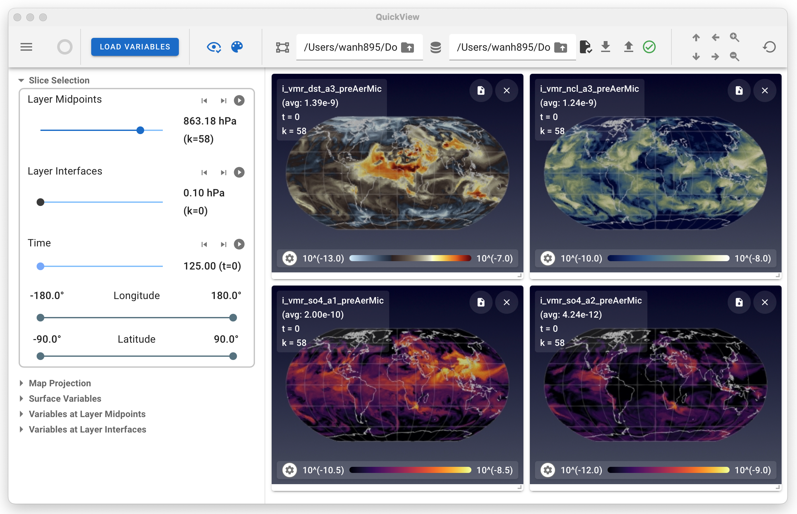

---
title:
  "EAM QuickView: A simulation data visualizer for the E3SM Atmosphere Model"
tags:
  - Python
  - visualization
  - graphical user interface
  - atmosphere modeling
authors:
  - name: Abhishek Yenpure
    orcid: 0000-0002-7403-7661
    corresponding: true # (This is how to denote the corresponding author)
    affiliation: 1
  - name: Berk Geveci
    orcid: 0000-0003-2477-4855
    affiliation: 1
  - name: Sebastien Jourdain
    orcid: 0000-0001-8083-271X
    affiliation: 1
  - name: Hui Wan
    orcid: 0000-0001-5294-4116
    affiliation: 2
  - name: Kai Zhang
    orcid: 0000-0003-0457-6368
    affiliation: 2
affiliations:
  - name: Kitware Inc., United States
    index: 1
    ror: 02s2acn37 # https://ror.org/02s2acn37
  - name:
      Atmospheric, Climate, and Earth Sciences Division, Pacific Northwest
      National Laboratory, United States
    index: 2
    ror: 05h992307 # https://ror.org/05h992307
date: 05 January 2025
bibliography: paper.bib
---

# Summary

EAM QuickView is a visualization application (app) providing overviews of the
geographical distribution of quantities simulated by a global atmospheric model,
the Energy Exascale Earth System Model (E3SM) Atmosphere Model (EAM), directly
from the NetCDF files generated by simulations. Compared to existing
visualizers, EAM QuickView supports displaying multiple quantities and arranging
different figures by drag-and-drop, as well as saving the state of the
visualization and resuming at a later time. Under the hood, the app uses the
Python-based [trame](https://www.kitware.com/trame/) framework to create a
simple and tailored user interface (UI) to the general-purpose data analysis and
visualization tool [ParaView](https://www.paraview.org/). This design makes
ParaView easily accessible to atmospheric scientists without requiring expertise
in visual analytics.

# Statement of need

EAM, like many other simulation codes used in Earth system sciences, solves a
complex set of equations and writes out results for a large number of physical
quantities in the form of NetCDF files. After a simulation is completed and
before more detailed analyses are performed, it is often useful to
obtain a first impression of the characteristic values of the simulated
quantities and their geographical distributions. The atmosphere modelers' wish
for tools that can simultaneously present multiple variables has become more
prominent in recent years  due to the rapid increase of model complexity in
terms of the number of equations solved by the numerical models and the number
of variables typically archived in the NetCDF files. For example, to inspect the
simulated aerosol life cycles, it is very useful to examine the concentrations of
multiple chemical components in different particle size ranges (see Figure 1).

# State of the field

Several tools exist for quick visualization of NetCDF files produced by Earth system
models. [ncview](https://cirrus.ucsd.edu/ncview/) [@DavidWPierce:1993]
has been widely used in Earth system modeling communities
for rapid, push-button inspections of NetCDF files. The newer tool
[ncvis](https://github.com/SEATStandards/ncvis) developed by [@PaulUllrich:2022] and
inspired by ncview extends this capability to data defined on unstructured meshes, making it usable out of the box for a broad range of models and mesh types.
While EAM QuickView is also designed for rapid inspections, it was developed to address the need to simultaneously display multiple variables in a single viewport and to support flexible rearrangement of variables during scientific reasoning. To facilitate this more sophisticated analysis workflow, QuickView also includes session persistence via state files that can be saved and reloaded, allowing users to resume analysis and achieve provenance.

To leverage state-of-the-art capabilities in visual analytics, EAM QuickView uses [ParaView](https://www.paraview.org/) [@Ahrens:2005; @Henderson:2007] as its visualization engine, thereby inheriting ParaView’s extensive collection of analysis algorithms and its built-in support for parallel processing of large data sets—capabilities that are indispensable for atmospheric models in the era of high-resolution modeling. By design, EAM QuickView departs from ParaView’s general-purpose UI which presents a steep learning curve and has repeatedly proven to be a barrier to effective use for scientists unfamiliar with the visual analytics paradigm. Instead, EAM QuickView provides a UI explicitly tailored to the scientific language and reasoning workflows of atmospheric modeling. The UI is intentionally focused on rapid inspection of simulation output. In this sense, EAM QuickView represents the first prototype in a family of ParaView-based analysis UIs that is purpose-built for atmospheric applications. Additional members of this tool family currently under development target workflows such as rapid comparison of multiple simulations and flexible slicing of three-dimensional fields using arbitrary planes and bounding boxes.

# Software design

EAM QuickView is built on the [trame](https://www.kitware.com/trame/) framework [@Kitware:2024:trame]
and is distributed as a native desktop application using Tauri
[@Tauri:2024] via the trame-tauri library [@Kitware:2022:trame-tauri]. Trame
enables developers to control application behavior through triggers and change
listeners on UI elements while providing widgets that integrate with
visualization tools including ParaView. The trame-vtk widget
[@Kitware:2024:trame-vtk] is used specifically for displaying ParaView
renderings within the Trame application, providing seamless integration of
VTK/ParaView visualization capabilities. ParaView's Python plugin system allows
developers to create readers, filters, and writers entirely in Python without
recompiling the C++ application, significantly accelerating development. For
QuickView, custom NetCDF readers and specialized filters for processing EAM data
were implemented as Python plugins. Tauri transforms the web application into a
native desktop application, eliminating the need for users to install ParaView
or configure Python environments by bundling all dependencies into a single
executable with smaller application sizes and lower memory usage compared to
alternatives.

Since the initial work was focused on facilitating the development of EAM, our
app is designed to work with the cubed sphere horizontal mesh and the
pressure-based terrain-following vertical coordinate. The adaptation of EAM
QuickView for other models and meshes can be done by updating the ParaView
Reader in the app.

# Research impact statement

Early adoption of EAM QuickView before its version 1 release has demonstrated the utility of the multi-panel visualization and session persistence features for iterative model development and debugging workflows.
The release of EAM QuickView version 1 has triggered interests from the developers of other (e.g., land, ocean, and ice) components of the E3SM model. Work has started to generalize the app to support the meshes and file formats of these other model components.

# AI usage disclosure

No generative AI tools were used in the development of this software.
Some of the paragraphs in this manuscript were edited by ChatGPT to improve grammar and readability;
the text edited by ChatGPT was reviewed and further revised by the authors to ensure the adopted edits conveyed the intended messages.

# Acknowledgements

The authors thank Mark A. Taylor for helping with the generation of grid
connectivity files needed for ParaView to parse EAM simulation output.

This work was supported primarily by the U.S. Department of Energy (DOE), Office
of Science, Scientific Discovery through Advanced Computing (SciDAC) program via
a partnership between the Advanced Scientific Computing Research (ASCR) and the
Biological and Environmental Research (BER). KZ was supported by DOE BER through
the E3SM project.

The work used resources of the National Energy Research Scientific Computing
Center (NERSC), a DOE Office of Science User Facility located at Lawrence
Berkeley National Laboratory, operated under contract DE-AC02-05CH11231, using
NERSC awards ASCR-ERCAP0025451, ASCR-ERCAP0028881, ASCR-ERCAP0033440, and
BER-ERCAP0030805. Pacific Northwest National Laboratory is operated by Battelle
Memorial Institute for the U.S. Department of Energy under contract
DE-AC06-76RLO1830.

# References
